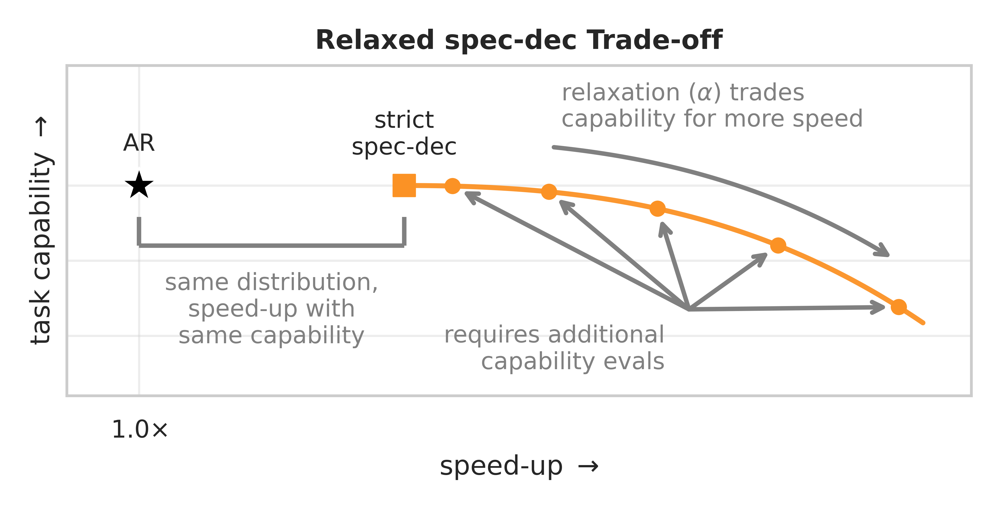

# A Practical Investigation of Training-free Relaxed Speculative Decoding

<p align="center">
  
</p>

This repository contains code to reproduce the results in our paper.

## Scope

Included tasks:

- AIME24: 30 H4 AIME 2024 problems.
- GPQA Diamond: 198 questions with deterministic answer-choice shuffling.
- LiveCodeBench Code Generation Lite v6: the 175-problem non-cumulative v6
  test split.

Included model settings:

- Qwen3-32B verifier with Qwen3-0.6B drafter.
- Qwen3-32B verifier with Qwen3-8B drafter.
- Qwen3.5-27B native MTP.

Included methods:

- AR verifier baseline.
- strict speculative decoding.
- always-accept drafter baseline.
- `CACTUS`, `mentored-dec`, `spec-casc-opt`, `spec-casc-tok`, `r-fuzzy`,
  `ens`, and `spec-cont-dec`.

No generated model outputs are distributed. Reproducibility comes from the
runner, exact configs/grid, dataset preparation, scoring code, aggregation code,
and compact component profiles used for proxy speed.

## Setup

Use a fresh environment. The vLLM overlay mutates the installed vLLM Python
files, so do not apply it inside a shared environment.

```bash
uv sync
python scripts/apply_vllm_overlay.py
python scripts/prepare_data.py --tasks gpqa lcb
```

AIME24 is shipped as a checked-in 30-row fixture. GPQA may require an HF token:

```bash
export HF_TOKEN=...
python scripts/prepare_data.py --tasks gpqa
```

LCB evaluation executes generated Python. Run it in an isolated environment.

## Full Paper Rerun

Generate full configs:

```bash
python scripts/run_paper_grid.py write-configs \
  --preset full \
  --output-dir configs/generated/full
```

Run the full grid:

```bash
python scripts/run_paper_grid.py run \
  --preset full \
  --output-dir configs/generated/full \
  --runs-root runs/full \
  --evaluate-lcb
```

Full runs are expensive. The script uses the paper sampling settings:
temperature `0.6`, top-`p=0.95`, top-`k=20`, draft lengths `{3,5,10,20}`,
standard thinking budget `32768`, and standard maximum generation length
`36864`. Qwen3.5-27B on AIME24 and LCB uses thinking budget `65536` and maximum
generation length `69632`.

## Aggregation

Write compact run summaries:

```bash
python scripts/aggregate_results.py \
  --runs-root runs/full \
  --output runs/full/summary.csv
```

Compute proxy-speed reports for completed speculative runs:

```bash
python scripts/compute_proxy_speed.py \
  --run-dirs runs/full/<spec-run-dir> \
  --ar-baseline-run-dirs runs/full/<matching-ar-run-dir> \
  --profiles profiles/paper/qwen3_32b_0p6b_b200_profile.json \
  --output runs/full/proxy_speed.json
```

The included profiles are compact B200 component profiles used by the paper's
response-length-aware proxy-speed calculation.

## Notes

- Exact bitwise reproducibility is not expected.
- Seeds are fixed within task/model/method grids.
- Model weights are downloaded from their upstream providers.
- Full benchmark data is not committed, except the small AIME24 fixture.
- The vLLM overlay targets `vllm==0.20.1`.
